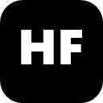

<div align="right">

**🇫🇷 Français** · [🇬🇧 English](README.en.md)

</div>

# HydraFreecker



> **Hydracker, débridé.** Un clic. Un lien direct. Zéro popup pourri.

Extension Chrome qui intercepte le bouton de téléchargement premium d'Hydracker et résout le lien via l'API Movix à la place. Plug-and-play : même clic, backend différent, modal custom.

Remplace la requête `https://hydracker.com/api/v1/content/liens/{id}` par `https://api.movix.tax/api/darkiworld/decode/{id}?title_id={titleId}`, spoofe `Referer`/`Origin` vers `https://movix.tax`, puis affiche un modal custom avec la réponse.

---

## Fonctionnalités

- **Interception transparente** — fonctionne avec l'UI Hydracker existante, aucun bouton à ajouter.
- **Spoofing des headers** — `Referer` et `Origin` réécrits via `declarativeNetRequest` pour que l'API Movix accepte la requête.
- **Modal natif** — thème sombre inspiré shadcn, animations d'ouverture/fermeture, icônes Lucide, boutons copier/ouvrir/télécharger.
- **Métadonnées riches** — qualité, langues (avec badges drapeau inline custom, pas d'emoji cassé sous Windows), taille, hébergeur (avec favicon), uploader, votes, dates, source/provider, IDs.
- **Inspecteur de réponse brute** — JSON dépliable avec animation de hauteur fluide.
- **Tueur de dialog site** — retire automatiquement le dialog "Téléchargement Premium" d'Hydracker pour n'afficher que celui d'HydraFreecker.

## Installation (mode développeur)

Le repo contient deux versions :

- `chrome/` — Chrome / Brave / Edge / Opera / Vivaldi (Chromium)
- `firefox/` — Firefox 128+

### Chrome / Chromium

1. Clone ou télécharge ce repo.
2. Ouvre `chrome://extensions` et active **Mode développeur** (en haut à droite).
3. Clique **Charger l'extension non empaquetée** → sélectionne le dossier `chrome/`.
4. Va sur `https://hydracker.com`, ouvre un titre, clique sur l'icône d'un hébergeur.

### Firefox

1. Clone ou télécharge ce repo.
2. Ouvre `about:debugging#/runtime/this-firefox`.
3. Clique **Charger un module complémentaire temporaire…** → sélectionne le fichier `firefox/manifest.json`.
4. Va sur `https://hydracker.com`, ouvre un titre, clique sur l'icône d'un hébergeur.

> Firefox 128+ requis (pour `world: "MAIN"` dans les content scripts). En mode dev, l'extension est retirée à chaque redémarrage du navigateur — pour un install permanent, signer le `.xpi` via [addons.mozilla.org](https://addons.mozilla.org).

L'extension n'a pas de popup ni de page d'options — elle tourne en arrière-plan.

## Comment ça marche

```
[ Page Hydracker ]
       │
       │  utilisateur clique sur icône 1Fichier (ou autre hébergeur)
       ▼
[ interceptor.js  (MAIN world, document_start) ]
       │  hook  window.fetch  +  XMLHttpRequest
       │  matche  GET /api/v1/content/liens/{id}
       │  capture title_id depuis /api/v1/titles/{title_id}/content/liens
       │  abort de la requête originale, postMessage → ISOLATED world
       ▼
[ content.js  (ISOLATED world) ]
       │  ouvre modal custom (état loading)
       │  tue aussi le dialog "Téléchargement Premium" d'Hydracker
       │  chrome.runtime.sendMessage → background
       ▼
[ background.js  (service worker) ]
       │  fetch  https://api.movix.tax/api/darkiworld/decode/{lienId}?title_id={titleId}
       │  declarativeNetRequest pose  Referer: https://movix.tax/
       │                              Origin:  https://movix.tax
       │  retourne le JSON parsé
       ▼
[ content.js render ]
       │  nom fichier, pill qualité, drapeaux langues, taille, badge hébergeur,
       │  boutons copier/ouvrir/télécharger, grid métadonnées, inspecteur JSON
       ▼
[ utilisateur clique Télécharger → lien direct ouvert dans nouvel onglet ]
```

## Structure du repo

```
HydraFreecker/
├── chrome/          # build Chromium (Chrome, Brave, Edge…)
├── firefox/         # build Firefox 128+
├── README.md        # ce fichier (FR)
├── README.en.md     # version anglaise
└── LICENSE          # MIT
```

Chaque dossier `chrome/` et `firefox/` contient les mêmes fichiers, seul `manifest.json` diffère.

| Fichier           | Rôle                                                                                  |
| ----------------- | ------------------------------------------------------------------------------------- |
| `manifest.json`   | Manifest MV3 (Chromium ou Gecko). Permission : `declarativeNetRequest`.                |
| `rules.json`      | Règle declarativeNetRequest — réécrit `Referer`/`Origin` sur les appels Movix API.    |
| `interceptor.js`  | Tourne en MAIN world. Patch `fetch` + `XMLHttpRequest` pour intercepter l'endpoint lien Hydracker. |
| `content.js`      | Tourne en ISOLATED world. UI du modal, watcher du dialog site, pont de messages.      |
| `background.js`   | Service worker (Chrome) / event page script (Firefox). Effectue le fetch cross-origin vers Movix. |
| `modal.css`       | Modal style shadcn, animations, pills, badges drapeau, icônes.                        |
| `icons/`          | Icônes extension (16/32/48/128 PNG) + SVG source.                                     |

## Personnalisation

### Ajouter d'autres drapeaux de langues

Édite la map `FLAGS` dans `content.js` :

```js
const FLAGS = {
  fr: ['#0055A4', '#FFFFFF', '#EF4135'],
  // [haut, milieu, bas] couleurs pour un badge 3 bandes
  xx: ['#color1', '#color2', '#color3'],
};
```

Les 2 premières lettres du nom de langue sont superposées sur les bandes — pas de dépendance aux emojis Unicode.

### Changer le endpoint API

Les deux endpoints sont codés en dur à trois endroits :

- Pattern de match dans `interceptor.js` (`LIEN_RE`)
- Construction d'URL dans `background.js`
- Condition de réécriture des headers dans `rules.json` (`urlFilter`)

Pour pointer vers un autre backend debrid, modifie les trois.

### Ajuster le modal

`modal.css` expose des variables HSL shadcn en haut de `#movix-modal-root` — modifie couleurs, radii, fonts, durées d'animation là.

## Notes & limitations

- **`AbortError` dans la console** — Hydracker peut logger le fetch annulé. Sans conséquence.
- **DirectDL parfois absent** — pour certains liens l'API Movix retourne l'URL hébergeur d'origine (`embed_url.lien`) plutôt qu'un lien direct débridé. Le modal affiche l'URL disponible.
- **`title_id` best-effort** — récupéré depuis le dernier fetch `/api/v1/titles/{id}/content/liens`, fallback sur l'URL de la page. Si rien matche, le paramètre est omis dans la requête Movix.

## Licence

[MIT](LICENSE). À tes risques — dépend de l'API tierce Movix et de la structure actuelle des pages Hydracker ; les deux peuvent changer.

---

## Star History

<a href="https://star-history.com/#MysticSaba-max/HydraFreecker&Date">
  <picture>
    <source media="(prefers-color-scheme: dark)" srcset="https://api.star-history.com/svg?repos=MysticSaba-max/HydraFreecker&type=Date&theme=dark" />
    <source media="(prefers-color-scheme: light)" srcset="https://api.star-history.com/svg?repos=MysticSaba-max/HydraFreecker&type=Date" />
    
  </picture>
</a>

Si le projet t'a servi, lâche une ⭐ sur [github.com/MysticSaba-max/HydraFreecker](https://github.com/MysticSaba-max/HydraFreecker) — ça aide à le faire connaître.
